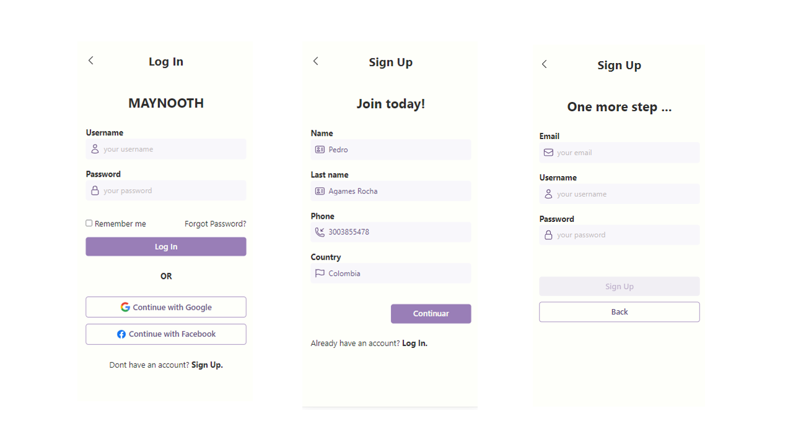

# VIIO TEST

## Table of Contents

- [Overview](#overview)
- [Demo user](#default-user)
- [Built With](#built-with)
- [Features](#features)
- [Instructions](#instructions)
- [How to Use](#how-to-use)

## Overview



## Demo user
- username: johnd
- password: m38rmF$

## Built With

- [React JS](https://reactjs.org/)
- [Typescript](https://www.typescriptlang.org/)
- [React Router Dom](https://reactrouter.com/en/main)
- [SASS](https://sass-lang.com/)
- [Hero Icons](https://heroicons.com/)
- [Swiper](https://swiperjs.com/)

## Features
- Log In
- Sign Up
- Home
- Search
- Product Detail

## Instructions
1. **Prerequisites**
   - Ensure that you have Node.js installed on your computer. You can download it from [here] (https://nodejs.org/es/).
   - Ensure that you have Git installed on your computer. You can download it from [here](https://git-scm.com/downloads).

## How to Use

   ```bash
   # Clone this repository
   $ git clone https://github.com/peterleunam1/viio-test
   # Install dependencies
   $ npm install 

   # Run app
   $ npm run dev 

   # Run tests
   $ npm run test

   # Build app
   $ npm run build
   $ npm run start
   ```


